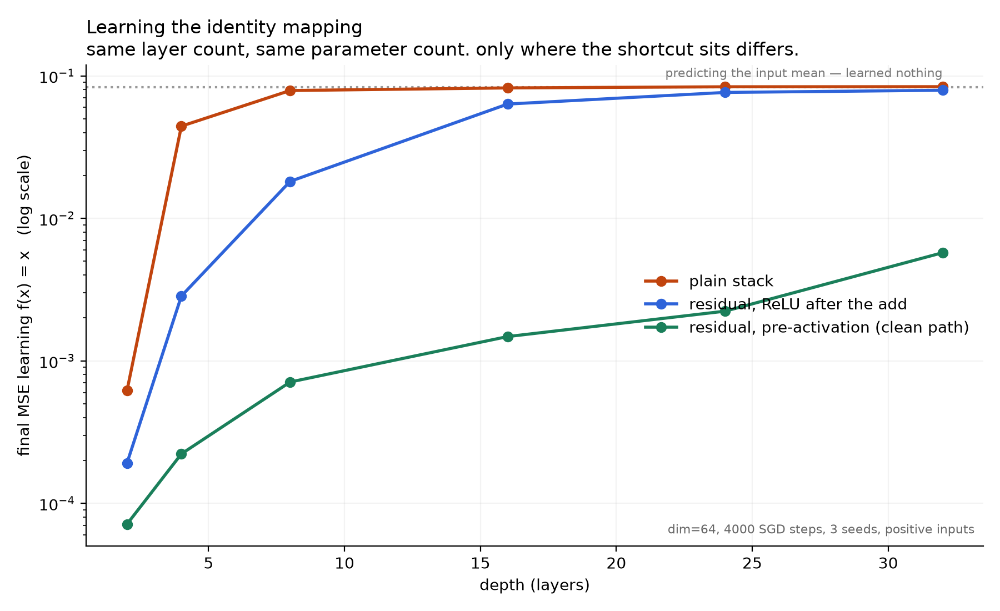

# resnet-degradation

A validation spike on **He et al. 2015, *Deep Residual Learning for Image Recognition*** ([arXiv:1512.03385](https://arxiv.org/abs/1512.03385)).

Two experiments, run on CPU:

1. **Mechanism test** — can SGD find an identity mapping through a deep plain stack?
2. **Degradation replication** — do deeper *plain* CIFAR-10 nets really train worse, and does the shortcut fix it?

## What the paper claims

Stacking more layers on a plain network makes **training** error go up, not just test error. That rules
out overfitting. The paper calls this *degradation*, and points out why it is surprising: a 56-layer net
can always match a 20-layer net by making its extra 36 layers identity mappings, so the capacity is
provably sufficient. SGD just does not find that solution.

The fix is to change what a block returns. Instead of learning the mapping `H(x)` directly, a block
learns a residual `F(x)` and returns `F(x) + x`, with the input skipping two layers. A block that
should do nothing now only has to push `F` toward zero.

## Honest scope

**This is a scaled-down reproduction, not a replication of the paper.** Stated plainly because the
result is only worth anything if the setup is:

| | Paper | Here |
|---|---|---|
| Hardware | GPU | CPU only (Intel Core Ultra 7 155H, 16C/22T) |
| Schedule | 64k iterations, ~182 epochs | 30 epochs, lr drops rescaled to 50% / 75% |
| Everything else | batch 128, SGD momentum 0.9, wd 1e-4, lr 0.1, 4px-pad random crop + hflip, 45k/5k split | same |

Architecture follows section 4.2 exactly: 3x3 convs, `6n+2` layers, feature maps 32/16/8 with 16/32/64
filters, global average pool, 10-way FC. Plain and residual variants are **identical except for the
shortcut**, and the shortcut uses the paper's CIFAR option A (stride-2 subsample + zero-padded
channels), which is parameter-free — so both families have the same parameter count and the comparison
is attributable to the shortcut alone.

A truncated run confirming an expected result is a **learning artifact, not a contribution.** Any
mismatch with the paper gets reported, not buried.

## The mechanism test, and one deliberate control

`identity_test.py` trains an N-layer plain stack and an N-layer residual stack to compute `f(x) = x`,
sweeping N, with identical parameter counts and 3 seeds each.

**Inputs are strictly positive.** That is a control, not a convenience: with positive inputs ReLU is
transparent, so a plain stack *can* represent the identity exactly (weights = identity). This removes
the representational confound and leaves a pure optimisation question, which is what the paper's
argument is actually about. With zero-centred inputs a plain ReLU stack cannot represent the identity
at all, and the experiment would be measuring something weaker.

## Running it

```powershell
uv venv --python 3.12
uv pip install torch torchvision --index-url https://download.pytorch.org/whl/cpu
uv pip install matplotlib

uv run python identity_test.py                                  # ~10 min
uv run python plots.py identity

uv run python train.py --arch plain  --depth 20 --epochs 30      # the overnight set
uv run python train.py --arch plain  --depth 56 --epochs 30
uv run python train.py --arch resnet --depth 20 --epochs 30
uv run python train.py --arch resnet --depth 56 --epochs 30
uv run python plots.py cifar
```

`train.py` writes its JSON log after every epoch, so a killed run still leaves usable data.

## Layout

```
models.py          plain + residual blocks (CIFAR nets and the identity-test MLPs)
identity_test.py   mechanism sweep
train.py           CIFAR-10 training, one model per invocation
plots.py           charts from the JSON logs
results/           JSON logs + PNG charts
```

## Results

### Mechanism test — partial confirmation

`dim=64`, 4000 SGD steps (lr 0.1, momentum 0.9), 3 seeds, BatchNorm in both families.
**Baseline: MSE 0.0833 is what you get by ignoring the input and predicting its mean.**
At or above that number, the network learned nothing.

| depth | plain | residual | ratio |
|---:|---:|---:|---:|
| 2 | 0.000618 | 0.000192 | 3.2x |
| 4 | 0.044359 | 0.002849 | **15.6x** |
| 8 | 0.078877 | 0.018167 | 4.3x |
| 16 | 0.082272 | 0.063376 | 1.3x |
| 24 | 0.083794 | 0.076470 | 1.1x |
| 32 | 0.083925 | 0.079230 | 1.1x |



**What this does confirm, and it is the paper's core premise:** a plain stack cannot learn the identity
mapping as it gets deeper. By depth 16 it has saturated at the mean baseline, and at 24 and 32 it has
learned nothing whatsoever. The identity is *provably representable* here (positive inputs make ReLU
transparent, so weights = I is an exact solution), and SGD still does not find it. Capacity was never
the problem. That is exactly the observation ResNet was built on.

**What this does NOT confirm:** that the shortcut fixes it at depth. Residual is clearly better in the
mid range (15.6x at depth 4, 4.3x at depth 8) but it degrades too, and by depth 24 to 32 it is also
approaching the baseline. In this setup the shortcut **delays** the failure rather than removing it.
The paper's ResNet-56 does not behave this way, so my proxy only partially reproduces the story.

### Why the shortcut wasn't enough — hypothesis raised, then tested, then confirmed

The residual blocks above apply ReLU *after* the addition, `relu(norm(Wx) + x)`, so a nonlinearity sits
on the shortcut path in every block. He et al.'s own follow-up, *Identity Mappings in Deep Residual
Networks* ([arXiv:1603.05027](https://arxiv.org/abs/1603.05027), 2016), found exactly this and moved to
pre-activation blocks so the identity path stays clean, which is what let them train 1001 layers.

Predicted before running it: a pre-activation variant should stay flat where the post-activation one
climbs. Implemented as `PreActResidualMLP` — `x = x + W(relu(norm(x)))`, nothing applied after the
addition, same layer count and same parameter count — and re-run at an identical config (same dim,
steps, lr, seeds; `plots.py` asserts config equality before merging the two result files).

| depth | plain | residual (ReLU after add) | residual (pre-activation) |
|---:|---:|---:|---:|
| 2 | 0.000618 | 0.000192 | **0.000071** |
| 4 | 0.044359 | 0.002849 | **0.000222** |
| 8 | 0.078877 | 0.018167 | **0.000710** |
| 16 | 0.082272 | 0.063376 | **0.001480** |
| 24 | 0.083794 | 0.076470 | **0.002231** |
| 32 | 0.083925 | 0.079230 | **0.005737** |

**Confirmed.** Pre-activation stays 1 to 2 orders of magnitude below the post-activation version at every
depth, and at depth 32 it is **13.8x** better than post-activation and **14.6x** better than plain, while
both of those sit at the do-nothing baseline. It does still drift upward with depth (7.1e-5 to 5.7e-3),
so depth is not entirely free even with a clean path — but it never comes close to failing.

**So the mechanism is more specific than "add a skip connection."** The shortcut only buys you depth if
nothing is applied on top of the addition. In this experiment the post-activation ordering was the
difference between a residual net that fails at depth 32 and one that does not.

Scope limits, stated plainly: this is a 64-dimensional MLP learning the identity function, not a
convolutional net on images, and the effect size on a real task is not something this experiment can
speak to. It confirms the direction the 2016 paper argued, on one synthetic task, on a laptop.

### Supporting measurements

Three more figures, all from forward/backward passes at initialisation or from the existing result
files, so none of them required additional training.

**1. Why normalisation was needed** (`results/activation_growth.png`) — mean output magnitude at init
with normalisation OFF, i.e. the exact configuration that produced NaNs:

| depth | plain | residual | pre-activation |
|---:|---:|---:|---:|
| 2 | 0.073 | 0.68 | 0.74 |
| 16 | 0.025 | 2.60 | 3.37 |
| 48 | 0.028 | **131.0** | **60.3** |

Plain activations stay flat. Both residual variants compound, because each block adds to a running
sum. This is the measured cause of the depth-24 divergence, and it also shows the shortcut is not free:
it needs normalisation to behave like a pass-through rather than an amplifier.

**2. Gradient magnitude at the first layer** (`results/gradient_reach.png`) — one backward pass at
init, normalisation ON. **Read this one carefully: bigger is not better, flat with depth is.**

| depth | plain | residual | pre-activation |
|---:|---:|---:|---:|
| 2 | 0.129 | 0.353 | 0.330 |
| 16 | 1.77 | 3.29 | 0.951 |
| 48 | **670.9** | 13.8 | **2.70** |

**This kills the lazy explanation.** The plain stack's gradients do not vanish, they **explode** — by
nearly three orders of magnitude at depth 48. Pre-activation is almost flat. So the failure to learn
identity is not a starved-gradient problem, it is a badly-conditioned one. That matches He et al.,
who explicitly rule out vanishing gradients as the cause of degradation on the grounds that
normalisation already handles it. Worth stating because "deep nets fail because gradients vanish" is
the reflex answer, and this measurement contradicts it in our setting.

**3. Every seed shown** (`results/seed_spread.png`) — the headline means with all 3 individual seeds
plotted, so the separation between the three families is visibly not one lucky run.

### Degradation (CIFAR-10)
_pending — timing probe running to size the schedule._
